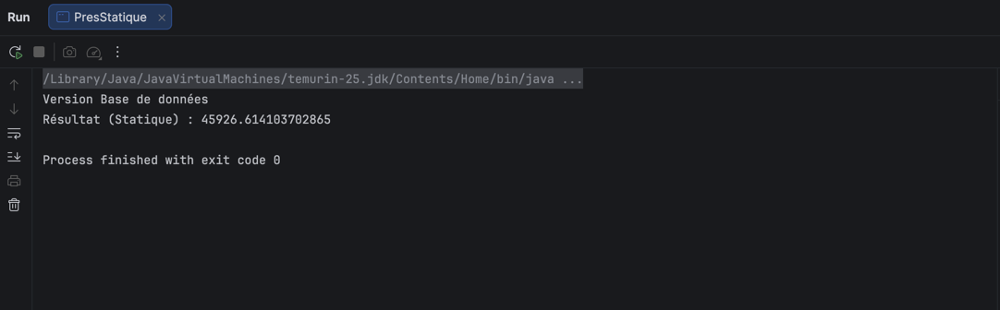
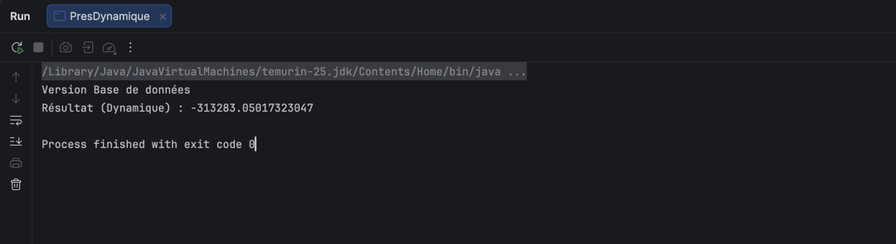
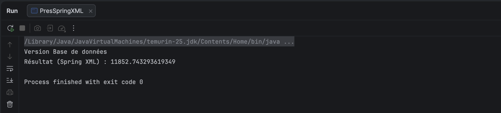
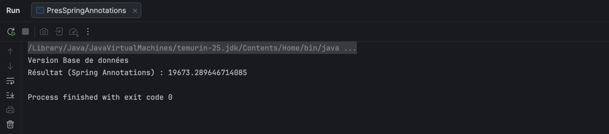

# TP 1 : Inversion de Contrôle (IoC) et Injection des Dépendances (DI)

**Réalisé par :** Oussama Boustane

Ce projet est une implémentation pratique démontrant les concepts de couplage faible, d'inversion de contrôle et d'injection des dépendances en Java, en passant d'une instanciation manuelle à l'utilisation du framework Spring.

---
## 🏗️ Architecture du Projet

Le projet est découpé en trois couches principales pour respecter la stricte séparation des responsabilités :
1. **Couche DAO (Data Access Object) :** Gestion et extraction des données.
2. **Couche Métier :** Traitement fonctionnel et implémentation de la logique métier.
3. **Couche Présentation :** Interface d'exécution et tests des différentes méthodes d'injection.

---
## 1. Création de l'interface IDao (Couche DAO)
Création de l'interface `IDao` définissant le contrat pour la récupération des données avec la méthode `getData()`.

## 2. Implémentation de l'interface IDao
Création de la classe `DaoImpl` qui implémente l'interface `IDao`. Cette classe simule la récupération d'une température depuis une base de données.

## 3. Création de l'interface IMetier (Couche Métier)
Création de l'interface `IMetier` définissant le besoin fonctionnel avec la méthode `calcul()`.

## 4. Implémentation de l'interface IMetier (Couplage faible)
Création de la classe `MetierImpl`. Pour respecter le principe du **couplage faible**, cette classe dépend de l'interface `IDao` et non d'une implémentation spécifique. Aucune instanciation (mot-clé `new`) n'est faite à l'intérieur de cette classe.

---

## 5. Injection des dépendances (Couche Présentation)

### a. Par instanciation statique
L'injection est réalisée manuellement dans la classe `PresStatique` en utilisant le mot-clé `new`. Cette méthode lie fortement la couche de présentation aux implémentations spécifiques.

> **Résultat de l'exécution (Statique) :**
*(👉*

### b. Par instanciation dynamique
Utilisation de l'API Reflection de Java et d'un fichier de configuration `config.txt` dans la classe `PresDynamique`. Le nom des classes est lu dynamiquement au moment de l'exécution, rendant l'application fermée à la modification et ouverte à l'extension.

> **Résultat de l'exécution (Dynamique) :**
**

### c. En utilisant le Framework Spring (Version XML)
Délégation de la création des objets et de l'injection des dépendances à Spring via le fichier de configuration `applicationContext.xml`. L'application utilise `ClassPathXmlApplicationContext`.

> **Résultat de l'exécution (Spring XML) :**
**

### d. En utilisant le Framework Spring (Version Annotations)
Utilisation de l'approche moderne avec les annotations `@Component` (pour déclarer les beans) et `@Autowired` (pour l'injection automatique). La configuration se fait via `AnnotationConfigApplicationContext` qui scanne les packages spécifiés.

> **Résultat de l'exécution (Spring Annotations) :**
*(*

## 🎯 Conclusion

Ce travail pratique illustre parfaitement la puissance et l'utilité de l'**Inversion de Contrôle (IoC)** dans le développement logiciel.

En suivant l'évolution de l'architecture, nous avons pu constater que :
1. **L'instanciation manuelle (`new`)** crée un couplage fort, rendant la maintenance difficile.
2. **Le couplage faible (via les interfaces)** est la première étape indispensable pour concevoir une application évolutive.
3. **Le framework Spring** pousse ce concept à son paroxysme en prenant le contrôle total du cycle de vie des objets (création et assemblage).

Grâce à Spring (et particulièrement avec l'approche par annotations), l'application devient totalement **fermée à la modification et ouverte à l'extension**. Le développeur est ainsi libéré de la gestion technique des dépendances et peut se concentrer exclusivement sur l'implémentation de la logique métier, garantissant un code propre, modulaire et hautement maintenable.